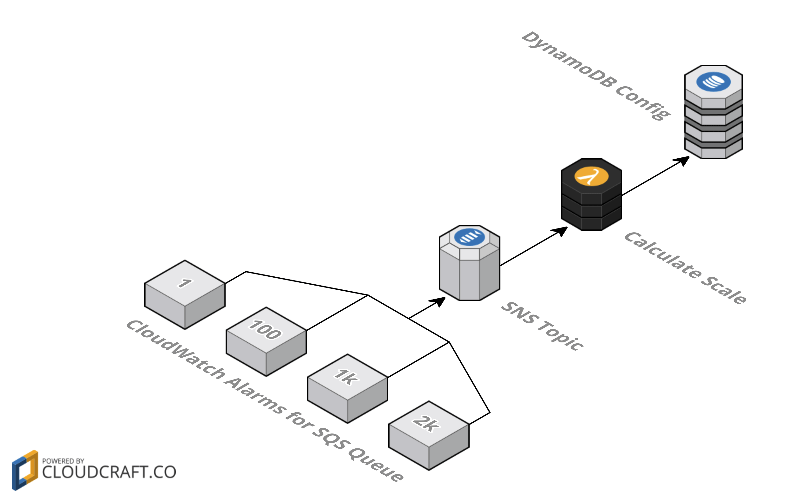
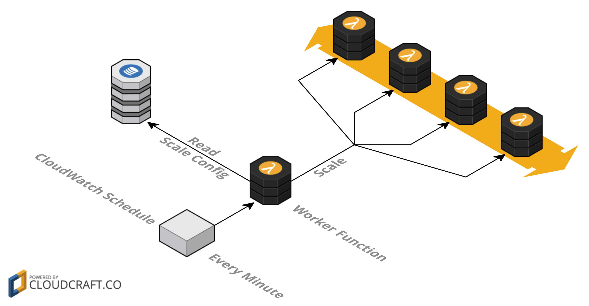

# ⚡️ SQS Worker with Serverless

[](https://github.com/sbstjn/sqs-worker-serverless/blob/master/LICENSE.md)
[](https://circleci.com/gh/sbstjn/sqs-worker-serverless)

Example code for an Amazon SQS worker with AWS Lambda using [lawos](https://github.com/sbstjn/lawos) and [serverless](https://serverless.com).

## Setup

- SQS Queue with your messages
- SNS Topic to handle CloudWatch Alarms
- DynamoDB table to persist configuration
- CloudWatch Schedule as cron replacement
- Three (`scale`, `worker`, `process`) AWS Lambda functions

## Workflow

- CloudWatch Alarms on queue length post to SNS
- SNS Topic triggers `scale` Lambda function
- Function `scale` updates configuration in DynamoDB 
- CloudWatch Schedule invokes `worker` every `x` minute(s)
- Function `worker` reads configuration from DynamoDB
- Function `worker` invokes `process` function(s)

## Auto-Scaling with CloudWatch Alerts

 

## Workers with CloudWatch Schedule



## Deploy

```bash
$ > yarn install
$ > yarn deploy
```

## Add noise to SQS

You should have some data in your queue to test this setup. Use [wrk](https://github.com/wg/wrk) to send messages to SQS, but make sure to enable [anonymous access to sendMessage](http://docs.aws.amazon.com/AWSSimpleQueueService/latest/SQSDeveloperGuide/acp-overview.html#anonQueues) for your queue first!

```
$ > wrk -c35 -d60 -t35 \
    -s helpers/wrk.lua \
    https://sqs.REGION.amazonaws.com/ACCOUNT-ID/YourQueueName
```
